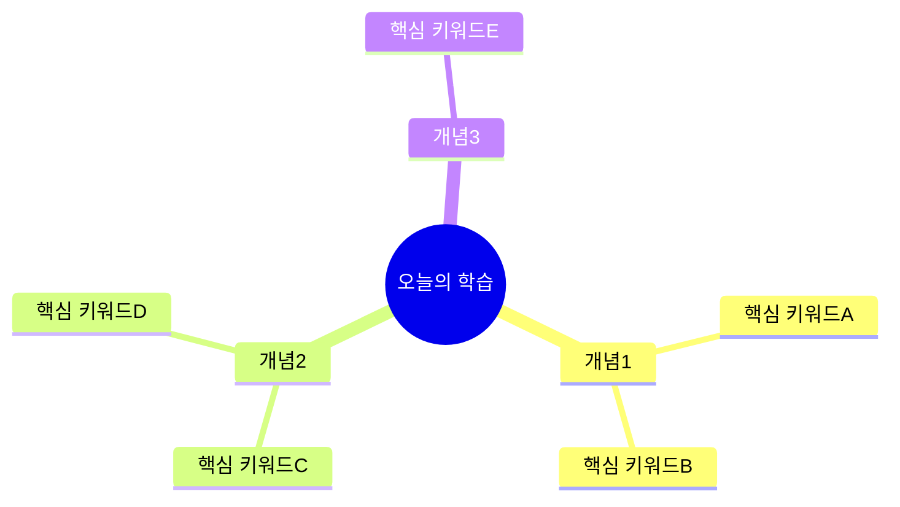
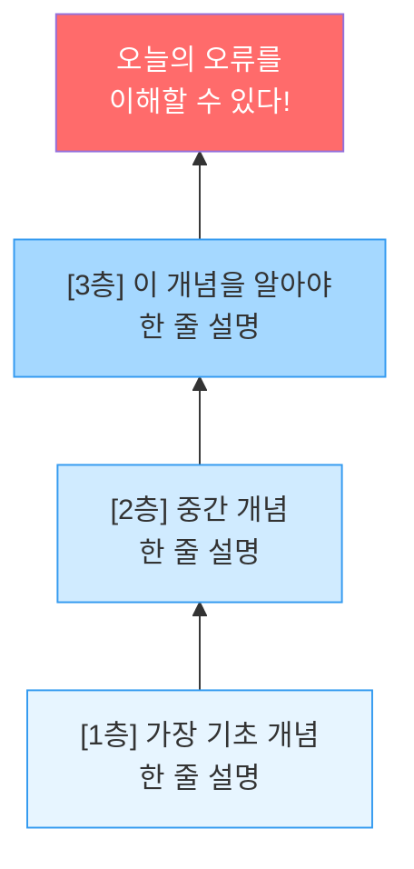
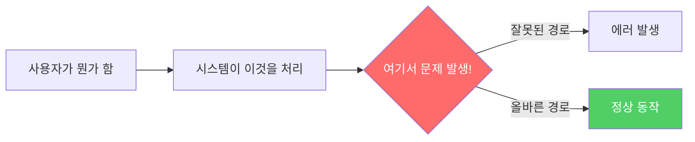
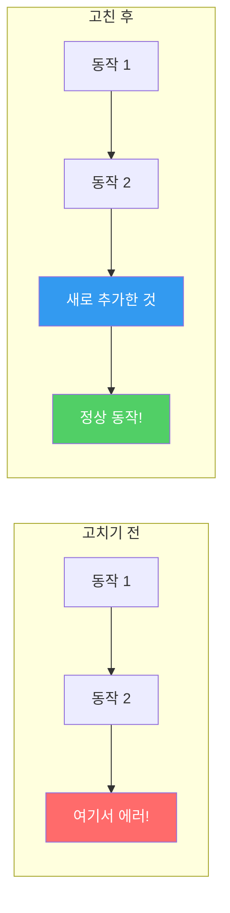
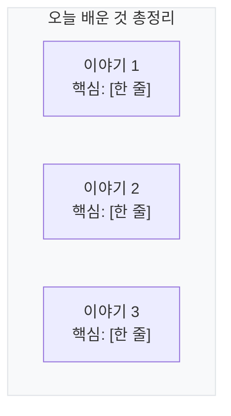

# Today Study - 오늘의 오류 로그 → 학습 자료 변환 스킬

<skill>
name: today-study
description: 오늘의 오류 해결 로그를 비전공자도 이해할 수 있는 쉬운 학습 자료로 변환한다
user-invocable: true
arguments: [date]
</skill>

## 목적

하루 동안 발생한 오류 해결 로그(`docs/error-logs/YYYY-MM-DD.md`)를 읽고, 각 오류에서 배울 수 있는 개념을 **비전공자도 이해할 수 있는 수준**으로 변환한다. 핵심 개념을 이해하기 위해 **먼저 알아야 하는 선수 지식부터 차근차근 쌓아올리는 계단식 구조**로 작성한다. 퇴근길에 가볍게 읽으며 "아~ 그래서 그랬구나!" 하고 이해할 수 있는 자료를 만든다.

## 인자 처리

- 인자가 없으면: 오늘 날짜의 로그 파일을 사용한다
- 날짜가 주어지면: 해당 날짜의 로그 파일을 사용한다 (예: `2026-04-08`)

## 실행 절차

### Step 1: 오류 로그 읽기

1. `nextjs-app/docs/error-logs/YYYY-MM-DD.md` 파일을 읽는다
2. 파일이 없으면 사용자에게 "오늘은 기록된 오류가 없습니다"라고 알린다
3. 각 오류 항목에서 추출:
   - 오류 제목
   - 증상
   - 원인
   - 해결 방법

### Step 2: 선수 지식 분석

각 오류의 핵심 개념에 대해 **선수 지식 트리**를 구성한다:
1. 이 오류를 이해하려면 어떤 개념을 알아야 하는가?
2. 그 개념을 이해하려면 또 어떤 걸 먼저 알아야 하는가?
3. 가장 기초적인 것부터 계단식으로 정렬한다

예시:
```
[1층] 데이터베이스 = 거대한 엑셀 표
  ↓
[2층] 테이블 간의 관계 = 표끼리 연결되는 것
  ↓
[3층] 외래 키 = 다른 표를 가리키는 화살표
  ↓
[4층] 연쇄 삭제 = 원본 지우면 화살표 따라 같이 지워지는 것
  ↓
[오늘의 오류] 여러 DB에서는 연쇄 삭제가 자동으로 안 된다!
```

### Step 3: 학습 구조 설계

오류 개수에 따라:
- 오류 1-2개: 단일 문서
- 오류 3-5개: 2-3개 섹션
- 오류 6개 이상: 관련 개념별로 그룹핑

### Step 4: 학습 자료 생성

출력 파일: `nextjs-app/docs/error-logs/STUDY_YYYY-MM-DD.md`

## 학습 자료 템플릿

```markdown
# 오늘의 학습 자료 - YYYY-MM-DD

> 예상 소요 시간: 약 30-40분
> 난이도: 비전공자도 이해할 수 있는 수준
> 기반: 오늘 해결한 오류 N건

---

## 오늘 뭘 배울까?

오늘 해결한 오류들에서 이런 것들을 배울 수 있다:



---

## 이야기 1: [오류를 재미있는 이야기 제목으로] (~10분)

### 무슨 일이 있었나?

> 한 줄 요약: [엘리베이터 피치처럼 한 문장으로]

[2-3문장으로 상황 설명. "~했더니 ~가 됐다" 형태로 직관적으로.]

### 이걸 이해하려면 먼저 알아야 할 것 (선수 지식)



#### [1층] [가장 기초 개념] — [비유 한 줄]

> 비유: [일상생활 비유. 2-3문장으로 충분히 풀어쓴다.]

| 비유 속 상황 | 실제로는... |
|---|---|
| [비유 요소] | [기술 요소] |
| [비유 요소] | [기술 요소] |

#### [2층] [중간 개념] — [비유 한 줄]

> 비유: [1층 비유를 확장해서 설명. 2-3문장.]

| 비유 속 상황 | 실제로는... |
|---|---|
| [비유 요소] | [기술 요소] |
| [비유 요소] | [기술 요소] |

#### [3층] [오류 직전 개념] — [비유 한 줄]

> 비유: [2층 비유를 한 단계 더 확장. 2-3문장.]

| 비유 속 상황 | 실제로는... |
|---|---|
| [비유 요소] | [기술 요소] |
| [비유 요소] | [기술 요소] |

> 여기까지 이해했으면, 오늘의 오류를 이해할 준비 완료!

### 그래서 왜 이런 일이 생겼을까? (원인)

#### 그림으로 보기



[선수 지식과 연결하여 원인을 2-3문장으로 설명.
"[1층]에서 배운 ~가 [2층]의 ~와 만나면서 이런 일이 생긴 것이다."
형태로 계단을 하나씩 올라가며 설명한다.]

### 어떻게 고쳤을까? (해결)

#### 고치기 전 vs 고친 후



**수정 전:**
```typescript
// 문제가 있던 코드 (핵심 3-5줄만)
```

**수정 후:**
```typescript
// 고친 코드 (핵심 3-5줄만)
```

[변경의 핵심을 1-2문장으로. "~를 추가해서 ~가 되도록 했다" 형태.]

### 다음에 같은 실수 안 하려면?

- [ ] 체크 1: [구체적인 행동. "~할 때는 ~를 확인하자"]
- [ ] 체크 2: [구체적인 행동]

### 핵심 단어장

| 용어 | 뜻 (쉽게) | 비유 |
|------|-----------|------|
| [용어1] | [한 줄 설명] | [한 줄 비유] |
| [용어2] | [한 줄 설명] | [한 줄 비유] |
| [선수지식 용어도 포함] | [한 줄 설명] | [한 줄 비유] |

---

## 이야기 2: [재미있는 제목] (~10분)

[동일한 구조: 선수 지식 계단 → 원인 → 해결]

---

## 이야기 3: [재미있는 제목] (~10분)

[동일한 구조]

---

## 오늘의 한눈에 보기



| # | 무슨 일이? | 왜? (한 줄) | 어떻게 고쳤나? (한 줄) | 기억할 것! |
|---|-----------|------------|---------------------|-----------|
| 1 | [제목] | [원인] | [해결] | [교훈] |
| 2 | [제목] | [원인] | [해결] | [교훈] |
| 3 | [제목] | [원인] | [해결] | [교훈] |

## 오늘 새로 배운 단어 모음

| 용어 | 뜻 (쉽게) | 비유 | 어디서 나왔나 |
|------|-----------|------|-------------|
| [용어1] | [한 줄] | [한 줄] | 이야기 1 |
| [용어2] | [한 줄] | [한 줄] | 이야기 1 |
| [선수지식 용어] | [한 줄] | [한 줄] | 이야기 2 |

## 스스로 확인해보기 (퀴즈)

### Q1: [O/X 또는 빈칸 채우기 형태의 쉬운 질문]

<details>
<summary>정답 보기</summary>

[간단한 정답 + 1-2문장 설명]

</details>

### Q2: [상황 제시 → "이럴 때 어떻게 해야 할까?" 형태]

<details>
<summary>정답 보기</summary>

[간단한 정답 + 1-2문장 설명]

</details>

### Q3: [코드 보고 "뭐가 잘못됐을까?" 형태]

```typescript
// 짧은 코드 (5줄 이내)
```

<details>
<summary>정답 보기</summary>

[간단한 정답 + 수정 코드]

</details>

## 다음에 더 알아보면 좋은 것

- [ ] [주제 1] - [왜 알면 좋은지 한 줄]
- [ ] [주제 2] - [왜 알면 좋은지 한 줄]
- [ ] [주제 3] - [왜 알면 좋은지 한 줄]

---
Generated by Today Study Skill
```

## 작성 원칙 (절대 지켜야 하는 것들)

### 대상: 비전공자

- **절대 전제하지 않는다**: 독자가 CS 지식이 없을 수 있다고 가정한다
- **전문 용어가 나오면 반드시 즉시 설명한다**: "캐스케이딩 삭제(연쇄적으로 줄줄이 지워지는 것)"처럼 괄호 안에 쉬운 말을 넣는다
- 존댓말 서술체를 쓰되 딱딱하지 않게 쓴다. "~이다", "~된다" 체를 쓰되 문장을 짧게 끊는다.

### 선수 지식: 계단식으로 쌓아올리기

**이것이 이 스킬의 핵심이다. 모든 이야기에 반드시 포함한다.**

- 오류의 핵심 개념을 이해하려면 먼저 뭘 알아야 하는지 **역추적**한다
- 가장 기초(누구나 아는 것)부터 시작해서 한 층씩 쌓아올린다
- **최소 2층, 최대 4층**으로 구성한다 (너무 많으면 지친다)
- 각 층은 **이전 층의 비유를 확장하는 방식**으로 연결한다
  - 예: 1층 "엑셀 표" → 2층 "표끼리 줄로 연결" → 3층 "줄을 따라 같이 지움"
- 각 층마다 반드시: 비유 + 비유-코드 매핑 표
- 선수 지식 계단 그림(flowchart BT)을 반드시 포함한다
- 원인 설명에서 "1층에서 배운 ~가..." 형태로 계단을 참조한다

### 설명 방식: 비유 먼저, 코드는 나중에

- **설명 순서**: 선수 지식 계단 → 그림으로 이해 → 비유로 이해 → 코드로 연결
- **비유는 반드시 일상생활에서**: 택배, 배달앱, 도서관, 학교, 카톡, 엘리베이터 등
- **비유와 코드를 표로 연결**: "비유에서 ~는 코드에서 ~에 해당한다"
- **코드는 핵심만 짧게**: 전체 파일이 아니라 변경된 3-5줄만 보여준다

### 그림은 최대한 많이!

**매 이야기(오류)마다 필수 그림:**
1. **선수 지식 계단 그림**: flowchart BT로 아래에서 위로 쌓아올리기
2. **원인 그림**: 왜 이런 일이 생겼는지를 flowchart로
3. **해결 전후 비교 그림**: 고치기 전 vs 고친 후를 나란히

**추가 권장 그림:**
- 전체 오류들의 관계를 보여주는 mindmap (문서 상단)
- 총정리 요약 그림 (문서 하단)
- 복잡한 흐름은 sequenceDiagram 사용
- 선수 지식의 개념 관계를 보여주는 그림

**그림 비율 목표: 전체 문서에서 그림이 40% 이상**

### 분량: 가볍게!

- **전체**: 30-40분 읽기 분량
- **이야기 하나당**: 약 10분 (선수 지식 포함)
- **한 문단**: 3-4문장 이내 (길면 읽기 싫어진다)
- 오류가 1개뿐이면 관련 개념을 넓혀서 30분을 채운다

### 퀴즈: 쉽고 재미있게

- O/X, 빈칸 채우기, "이 코드 뭐가 잘못됐을까?" 형태
- 선수 지식에서 배운 것도 퀴즈에 포함한다
- 서술형 답안이 아니라 짧은 정답 + 1-2문장 설명
- 최소 3개

### 핵심 단어장

- 각 이야기마다 새로 나온 용어를 표로 정리한다 (선수 지식 용어 포함!)
- "용어 | 쉬운 뜻 | 비유" 3열 구조
- 문서 하단에 전체 단어 모음도 포함한다

### 연결

- 오늘의 오류들이 서로 어떻게 연결되는지를 그림으로 보여준다
- 서로 다른 이야기의 선수 지식이 겹치면 "이야기 1에서 배운 ~가 여기서도 쓰인다"로 연결한다
- 어제/이전 로그가 있으면 "어제 배운 X와 관련이 있다" 정도만 언급한다

## 절대 하지 말아야 할 것

- 역사적 배경 서술 (에드거 코드가 언제 뭘 만들었다... 이런 거 NO)
- 500자 이상의 긴 서술형 문단 (읽다가 잠든다)
- 학술 논문 스타일의 "정식 정의" (사전 아니다)
- 영어 약어만 쓰고 설명 안 하기 (RDBMS, ORM 등은 반드시 풀어쓰기)
- 코드 전체를 붙여넣기 (핵심 3-5줄만!)
- 고급 개념을 설명 없이 언급 ("Saga 패턴" 같은 건 선수 지식으로 풀어야 한다)
- 선수 지식 없이 바로 어려운 개념 설명하기 (반드시 계단을 밟아야 한다)

## 품질 체크리스트

문서 생성 후 다음을 확인한다:
- [ ] 비전공자가 읽어도 이해할 수 있는가?
- [ ] 모든 전문 용어에 괄호 설명이 있는가?
- [ ] 모든 이야기에 선수 지식 계단(최소 2층)이 있는가?
- [ ] 선수 지식 계단 그림(flowchart BT)이 있는가?
- [ ] 각 층의 비유가 이전 층 비유를 확장하는 형태인가?
- [ ] 원인 설명에서 선수 지식 계단을 참조하고 있는가?
- [ ] 이야기마다 그림이 최소 3개(계단+원인+해결) 있는가?
- [ ] 비유가 모든 이야기에 포함되어 있는가?
- [ ] 비유와 코드가 표로 연결되어 있는가?
- [ ] 한 문단이 4문장을 넘지 않는가?
- [ ] 코드 블록이 5줄 이내인가?
- [ ] 퀴즈가 최소 3개 있는가?
- [ ] 핵심 단어장이 각 이야기에 있는가?
- [ ] 전체 읽기 시간이 30-40분인가?
- [ ] 그림 비율이 40% 이상인가?
